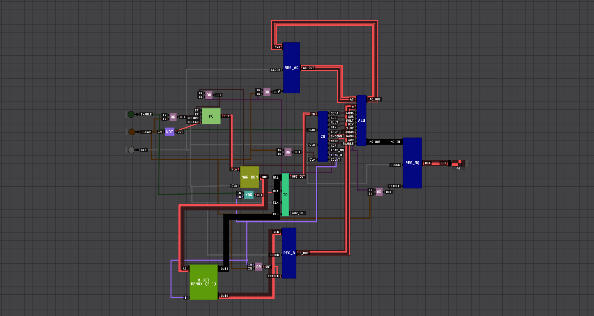

# CPU - Unidade Central de Processamento

## Introdução

Este projeto consiste na implementação de uma CPU (Unidade Central de Processamento) utilizando o simulador Digital Logic Sim. A CPU integra um caminho de dados (datapath) e uma unidade de controle (control unit) para buscar instruções em memória, decodificá-las e executá-las de forma sequencial.

Nesta arquitetura, os registradores fundamentais para o ciclo de instrução são:

- **Program Counter (PC)**: aponta para a próxima instrução.
- **Memory Address Register (MAR)**: guarda o endereço que será usado para acessar a memória.
- **Instruction Register (IR)**: armazena a instrução atual para decodificação e execução.
- **ROM**: memória de instruções (somente leitura), onde o programa fica armazenado.
- **Control Unit (CU)**: decodifica o opcode e gera os sinais de controle para movimentar dados e acionar a ALU.

---

## Componentes da CPU

### Program Counter (PC)

O **PC (Program Counter)** armazena o endereço da próxima instrução a ser executada. A cada ciclo de busca (fetch), ele normalmente é incrementado para avançar no programa; em instruções de desvio (jump/branch), pode ser carregado com um novo endereço.

No datapath, o valor do PC é usado como fonte de endereço durante a busca de instrução, alimentando o **MAR**.

---

### Memory Address Register (MAR)

O **MAR (Memory Address Register)** é o registrador que mantém o endereço efetivo que será enviado para a memória. Ele permite “congelar” um endereço de acesso mesmo enquanto outros sinais internos mudam.

Em uma CPU simples, durante o fetch o MAR recebe o endereço vindo do PC; em acessos a dados (load/store), ele pode receber o endereço calculado/selecionado pelo datapath, dependendo da instrução.

---

### ROM (Memória de Instruções)

A **ROM** é a memória onde o programa (sequência de instruções) fica armazenado. Por ser somente leitura, ela simplifica o projeto e deixa claro o fluxo básico de busca de instruções:

1. O **MAR** fornece o endereço.
2. A **ROM** coloca a instrução correspondente na saída.
3. O **IR** captura (latch) essa instrução.

> Observação: **MAR** e **ROM** são blocos diferentes. O MAR guarda o _endereço_; a ROM guarda o _conteúdo_ (instruções).

---

### Instruction Register (IR)

O **IR (Instruction Register)** armazena a instrução corrente, vinda da ROM. A partir do IR, a CPU separa os campos relevantes (por exemplo, **opcode** e **operandos**) para que a CU consiga decodificar e coordenar a execução.

Manter a instrução no IR também evita que a saída da ROM precise permanecer estável durante toda a execução: a ROM é consultada no fetch, e a instrução segue armazenada no IR até o fim do ciclo.

---

### Control Unit (CU)

A **CU (Control Unit)** é responsável por transformar a instrução (no IR) em sinais de controle que dirigem o datapath. Em termos práticos, ela:

- Decodifica o **opcode**.
- Seleciona a operação da **ALU**.
- Habilita/escreve registradores (enable/load).
- Controla multiplexadores e o caminho do dado.
- Controla o avanço/carregamento do **PC**.

Em uma implementação “hardwired”, essa lógica é feita com portas e decodificadores; em uma implementação “microprogramada”, a CU pode usar uma ROM de microinstruções. Aqui, o foco é demonstrar a coordenação entre fetch/decode/execute.

## Demonstração em Vídeo

Link para o vídeo demonstrativo da CPU em funcionamento: _(adicione aqui o link do vídeo)_
