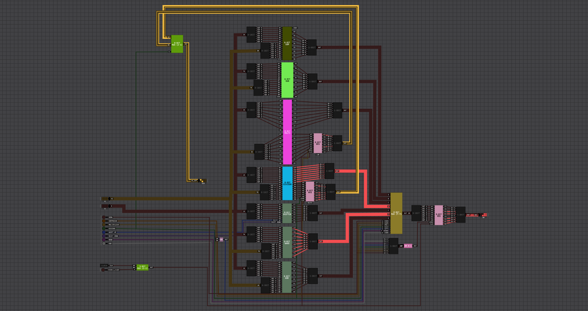
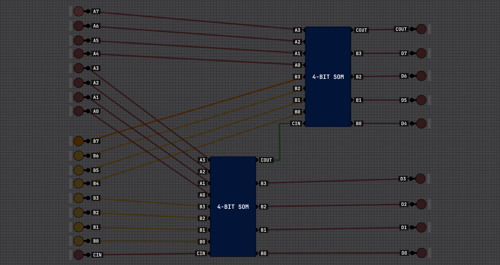
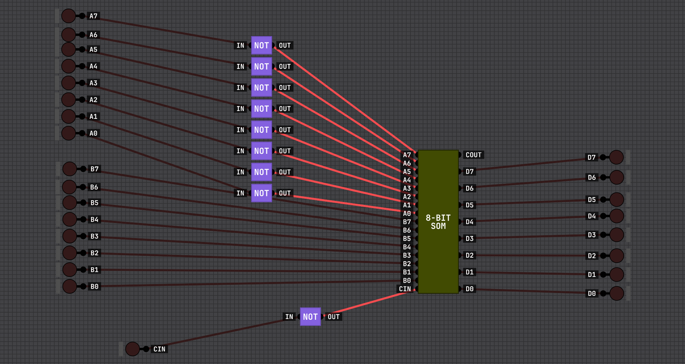
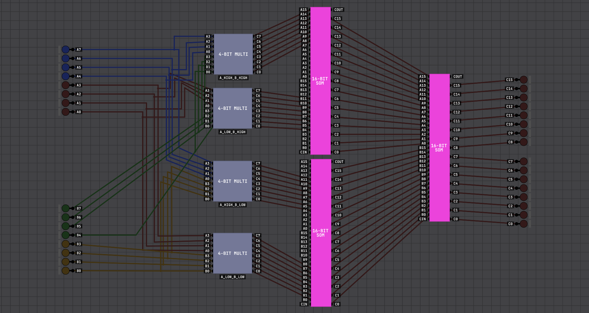
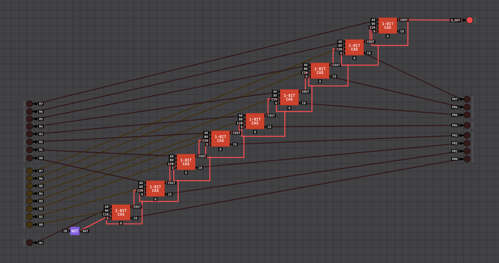

 # ALU - Unidade Lógica e Aritmética

## Introdução

Este projeto consiste na implementação de uma ALU (Unidade Lógica e Aritmética) utilizando o simulador Digital Logic Sim. A ALU é responsável por executar operações aritméticas e lógicas fundamentais, como soma, subtração, multiplicação, divisão e manipulação de bits. O objetivo do projeto é demonstrar, de forma prática, como essas operações podem ser construídas a partir de componentes básicos da lógica digital.

---

## Componentes da ALU

### Somador

O somador é a base de toda a ALU, sendo responsável por realizar operações de adição. Ele foi implementado de forma hierárquica, começando por somadores de 1 bit (full adders), que são combinados em somadores de 4 bits e, posteriormente, em um somador de 8 bits. Cada somador de 1 bit utiliza as entradas A, B e Carry In para gerar o resultado (SUM) e o Carry Out, permitindo a propagação do carry entre os bits.

---

### Subtrator

O subtrator reutiliza a estrutura do somador, aplicando a lógica de complemento de dois. Para isso, o valor de B é invertido e o Carry In é definido como 1, transformando a operação de subtração em uma soma. Dessa forma, a ALU consegue representar números negativos utilizando complemento de dois, onde o bit mais significativo indica o sinal do número.

---

### Multiplicador

O multiplicador foi implementado com base na soma de produtos parciais, semelhante ao método tradicional de multiplicação. A versão de 4 bits gera resultados de 8 bits a partir de operações AND e somadores intermediários. Já o multiplicador de 8 bits é composto por múltiplos blocos de 4 bits, combinados com deslocamentos (shifts) e somados em um somador maior, permitindo lidar com valores mais amplos.

---

### Divisor

O divisor utiliza uma abordagem baseada em subtrações sucessivas com restauração, implementada através de células chamadas CAS (Carry Add Subtract Cell). Cada célula tenta subtrair o divisor do valor atual e, caso o resultado seja negativo, o valor original é restaurado utilizando um multiplexador. Esse processo é repetido em sequência, gerando o quociente e o resto da divisão.

---

### Shifter, Operações Lógicas e Registrador

Além das operações aritméticas, a ALU também possui um shifter, responsável por deslocamentos de bits à esquerda e à direita, equivalentes a multiplicações e divisões por 2. Também estão presentes operações lógicas como NAND e XOR, que atuam bit a bit sobre as entradas. Por fim, o registrador permite armazenar temporariamente valores utilizando um D latch, funcionando como uma pequena memória dentro do sistema.

---

## Demonstração em Vídeo

Link para o vídeo demonstrativo da ALU em funcionamento: [Vídeo ALU](https://youtu.be/YFQhDgq-p_s)
