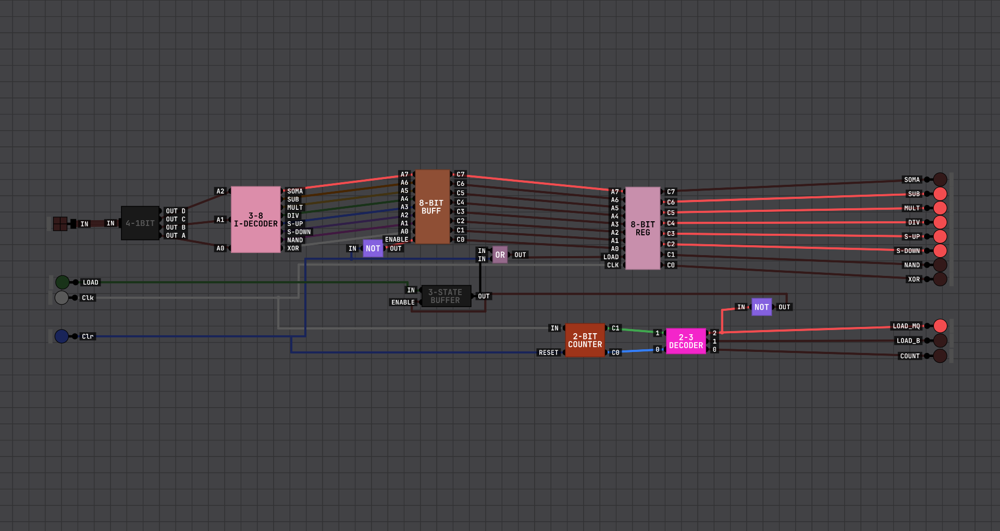
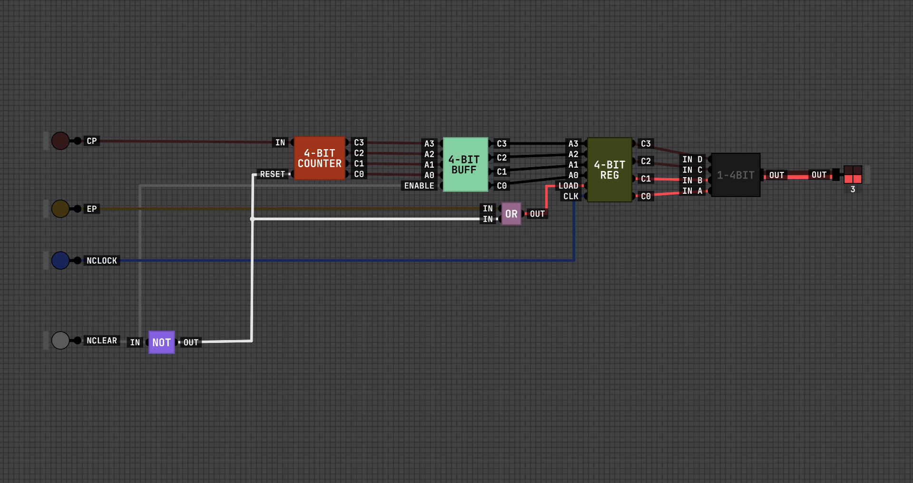
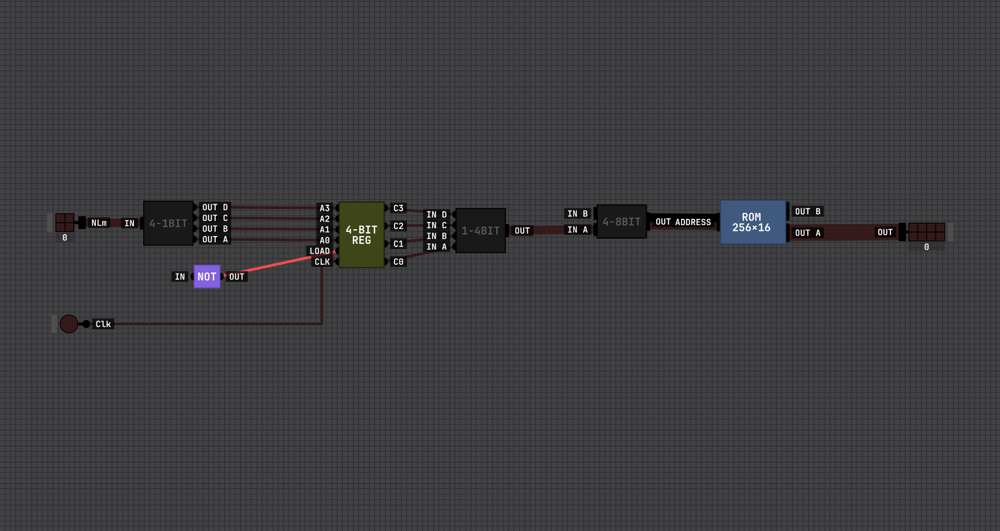
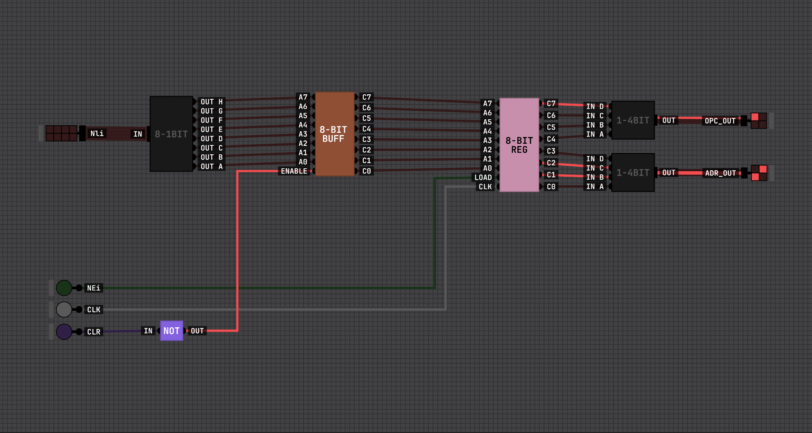

# CPU - Unidade Central de Processamento

## Introdução

Este projeto consiste na implementação de uma CPU (Unidade Central de Processamento) utilizando o simulador Digital Logic Sim. A CPU integra um caminho de dados (datapath) e uma unidade de controle (control unit) para buscar instruções em memória, decodificá-las e executá-las de forma sequencial.

Nesta arquitetura, os registradores fundamentais para o ciclo de instrução são:

- **Program Counter (PC)**: aponta para a próxima instrução.
- **Memory Address Register (MAR)**: guarda o endereço que será usado para acessar a memória.
- **Instruction Register (IR)**: armazena a instrução atual para decodificação e execução.
- **ROM**: memória de instruções (somente leitura), onde o programa fica armazenado.
- **Control Unit (CU)**: decodifica o opcode e gera os sinais de controle para movimentar dados e acionar a ALU.

---

## Componentes da CPU

### Program Counter (PC)

O **PC (Program Counter)** armazena o endereço da próxima instrução a ser executada. A cada ciclo de busca (fetch), ele normalmente é incrementado para avançar no programa; em instruções de desvio (jump/branch), pode ser carregado com um novo endereço.

No datapath, o valor do PC é usado como fonte de endereço durante a busca de instrução, alimentando o **MAR**.

---

### Memory Address Register (MAR)

O **MAR (Memory Address Register)** é o registrador que mantém o endereço efetivo que será enviado para a memória. Ele permite “congelar” um endereço de acesso mesmo enquanto outros sinais internos mudam.

Em uma CPU simples, durante o fetch o MAR recebe o endereço vindo do PC; em acessos a dados (load/store), ele pode receber o endereço calculado/selecionado pelo datapath, dependendo da instrução.

---

### ROM (Memória de Instruções)

A **ROM** é a memória onde o programa (sequência de instruções) fica armazenado. Por ser somente leitura, ela simplifica o projeto e deixa claro o fluxo básico de busca de instruções:

1. O **MAR** fornece o endereço.
2. A **ROM** coloca a instrução correspondente na saída.
3. O **IR** captura (latch) essa instrução.

> Observação: **MAR** e **ROM** são blocos diferentes. O MAR guarda o _endereço_; a ROM guarda o _conteúdo_ (instruções).

---

### Instruction Register (IR)

O **IR (Instruction Register)** armazena a instrução corrente, vinda da ROM. A partir do IR, a CPU separa os campos relevantes (por exemplo, **opcode** e **operandos**) para que a CU consiga decodificar e coordenar a execução.

Manter a instrução no IR também evita que a saída da ROM precise permanecer estável durante toda a execução: a ROM é consultada no fetch, e a instrução segue armazenada no IR até o fim do ciclo.

---

### Control Unit (CU)

A **CU (Control Unit)** é responsável por transformar a instrução (no IR) em sinais de controle que dirigem o datapath. Em termos práticos, ela:

- Decodifica o **opcode**.
- Seleciona a operação da **ALU**.
- Habilita/escreve registradores (enable/load).
- Controla multiplexadores e o caminho do dado.
- Controla o avanço/carregamento do **PC**.

Em uma implementação “hardwired”, essa lógica é feita com portas e decodificadores; em uma implementação “microprogramada”, a CU pode usar uma ROM de microinstruções. Aqui, o foco é demonstrar a coordenação entre fetch/decode/execute.

---

### ALU (Unidade Lógica e Aritmética)

A **ALU** é o bloco de execução: ela realiza operações aritméticas e lógicas que a CU seleciona de acordo com o opcode. As operações típicas incluem soma, subtração, deslocamentos e operações lógicas bit a bit.

#### Somador

O somador é a base de toda a ALU, sendo responsável por realizar operações de adição. Ele foi implementado de forma hierárquica, começando por somadores de 1 bit (full adders), que são combinados em somadores de 4 bits e, posteriormente, em um somador de 8 bits. Cada somador de 1 bit utiliza as entradas A, B e Carry In para gerar o resultado (SUM) e o Carry Out, permitindo a propagação do carry entre os bits.

---

#### Subtrator

O subtrator reutiliza a estrutura do somador, aplicando a lógica de complemento de dois. Para isso, o valor de B é invertido e o Carry In é definido como 1, transformando a operação de subtração em uma soma. Dessa forma, a ALU consegue representar números negativos utilizando complemento de dois, onde o bit mais significativo indica o sinal do número.

---

#### Multiplicador

O multiplicador foi implementado com base na soma de produtos parciais, semelhante ao método tradicional de multiplicação. A versão de 4 bits gera resultados de 8 bits a partir de operações AND e somadores intermediários. Já o multiplicador de 8 bits é composto por múltiplos blocos de 4 bits, combinados com deslocamentos (shifts) e somados em um somador maior, permitindo lidar com valores mais amplos.

---

#### Divisor

O divisor utiliza uma abordagem baseada em subtrações sucessivas com restauração, implementada através de células chamadas CAS (Carry Add Subtract Cell). Cada célula tenta subtrair o divisor do valor atual e, caso o resultado seja negativo, o valor original é restaurado utilizando um multiplexador. Esse processo é repetido em sequência, gerando o quociente e o resto da divisão.

---

#### Shifter, Operações Lógicas e Registrador

Além das operações aritméticas, a ALU também possui um shifter, responsável por deslocamentos de bits à esquerda e à direita, equivalentes a multiplicações e divisões por 2. Também estão presentes operações lógicas como NAND e XOR, que atuam bit a bit sobre as entradas. Por fim, o registrador permite armazenar temporariamente valores utilizando um D latch, funcionando como uma pequena memória dentro do sistema.

---

## Ciclo de Instrução (Fetch–Decode–Execute)

De forma resumida, a CPU segue o ciclo abaixo:

1. **Fetch**: o PC fornece o endereço, o MAR armazena esse endereço, a ROM entrega a instrução, e o IR captura a instrução.
2. **Decode**: a CU lê o opcode no IR e define os sinais de controle.
3. **Execute**: o datapath movimenta os operandos, a ALU executa a operação (se necessário) e o resultado é armazenado no destino.
4. **Update PC**: o PC é incrementado ou carregado com um novo endereço (em caso de desvio).

---

## Demonstração em Vídeo

Link para o vídeo demonstrativo da CPU em funcionamento: _(adicione aqui o link do vídeo)_
